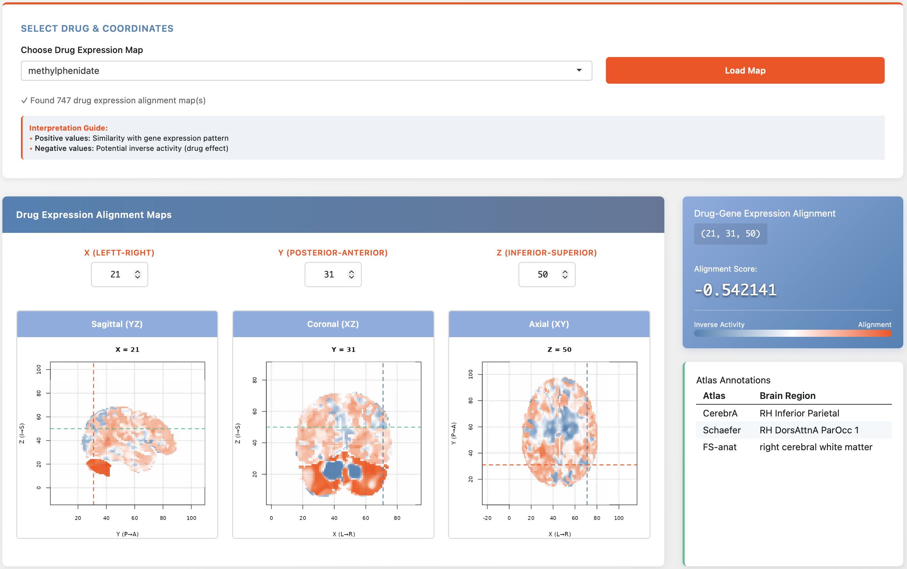

# Drug-Brain Alignment Mapping

This repository contains code to map drug-induced transcriptomic signatures onto the human brain by correlating them with spatially resolved gene expression predictions. It leverages the predicted gene expression maps from the [brain-gene-map](https://github.com/melsadany/brain-drug-map) project (or link to that repo) and the Connectivity Map (CMap/LINCS) database to generate whole‑brain 3D maps of drug similarity.

  
*Interactive viewer for drug‑brain alignment maps (sagittal, coronal, axial slices).*

## Overview

The project aims to visualize how a drug’s transcriptional signature aligns with gene expression patterns across the brain. For each voxel in a standard MNI space, the expression profile (across ~5000 genes) is correlated with the drug’s CMap signature. High positive values indicate spatial regions where the drug’s effect mimics the local gene expression; negative values suggest potential inverse activity.

1. **Load predicted brain gene expression** – from the companion project (2mm resolution, ~5000 genes).
2. **Filter drugs** – retain only those with predicted blood–brain barrier permeability >50% (based on a reference paper).
3. **Load CMap signatures** – for the filtered compounds, using the LINCS level 5 data.
4. **Voxel‑wise correlation** – compute Spearman correlation between each voxel’s gene expression vector and each drug’s signature.
5. **Generate NIfTI maps** – store the correlation volumes as NIfTI files for visualisation.
6. **Interactive Shiny app** – explore the maps slice by slice, with cross‑referenced atlas labels.

## Repository Structure

| File | Description |
|------|-------------|
| `01_brain-gex-to-CMAP.R` | Loads predicted brain expression, filters drugs, computes correlations, saves NIfTI maps |
| `02_nifti-to-shiny.R`    | Shiny app for interactive exploration of the drug‑brain alignment maps |

## Data Sources

- **Predicted brain gene expression** – generated by the `brain-gene-map` project (2mm MNI grid, ~5000 most variable genes). 
- **CMap/LINCS data** – a pre‑processed matrix of ~700 compounds × ~5000 genes 
- **Blood–brain barrier permeability** – filtered for FDA‑approved drugs with BBB permeability >0.5.
- **Atlas labels** – used in the Shiny app for region identification 

## Processing Pipeline

The R script `01_brain-gex-to-CMAP.R` performs the following steps:

1. **Load and align data**  
   - Load predicted brain expression (voxels × genes).  
   - Load CMap matrix and BBB‑filtered drug list.  
   - Intersect genes and compounds to keep only common genes and BBB‑passing drugs.

2. **Voxel‑wise correlation**  
   - For each voxel (row of brain expression matrix), compute Spearman correlation with each drug’s signature (row of CMap matrix).  
   - Result: a matrix of size (voxels × drugs) with correlation coefficients.

3. **Save results**  
   - Append MNI coordinates and save as an RDS file (`voxel-wise-drug-spearman-voxel-labeled.rds`).  
   - For each drug, create a NIfTI file by mapping the correlation values back to the 3D MNI grid, scaling to [-1,1] for consistent visualisation. The NIfTI files are stored in `data/derivatives/drug-nifti-maps/`.

## Interactive Shiny App

The app (`02_nifti-to-shiny.R`) lets you explore the drug‑brain maps interactively:

- **Drug selection** – dropdown list of all BBB‑passing compounds with available CMap signatures.
- **Orthogonal slices** – sagittal (YZ), coronal (XZ), and axial (XY) views displayed side‑by‑side.
- **Crosshair navigation** – click on any slice to move the crosshair; coordinate inputs update automatically.
- **Intensity readout** – shows the exact correlation value at the current voxel, with a color scale (blue = negative, white = zero, red = positive).
- **Atlas annotations** – displays region labels from **CerebrA**, **Schaefer**, and **FS‑anat** atlases for the selected voxel.

### App Controls

- **X, Y, Z numeric inputs** – manually set the crosshair position (voxel indices from 1 to grid dimensions).
- **Load Map button** – (re)loads the selected NIfTI file (auto‑loads on selection change as well).
- **Interpretation guide** – explains that positive values indicate alignment with the drug’s signature, negative values suggest inverse activity.

